# Лабораторна робота 1. Робота з СУБД PostgreSQL та основи SQL

## Загальна інформація

**Здобувач освіти:** Остаповець Данило Олександрович
**Група:** ІПЗ-31
**Обраний рівень складності:** 3

## Виконання завдань

### Список таблиць

```sql
-- Запит для отримання списку таблиць
SELECT table_name
FROM information_schema.tables
WHERE table_schema = 'public'
ORDER BY table_name;
```

Результат: У базі даних створено 8 основних таблиць: categories, customers, employees, order_items, orders, products, regions, suppliers.

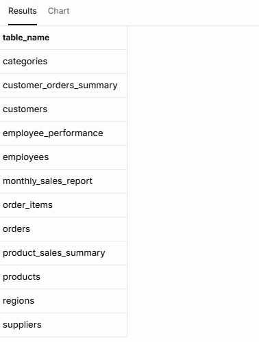

...


### Отримати всі записи з таблиці customers.

```sql
SELECT * FROM customers;
```

Результат: Отримано 15 записів клієнтів, включаючи як фізичних осіб, так і юридичні особи з різних міст України.

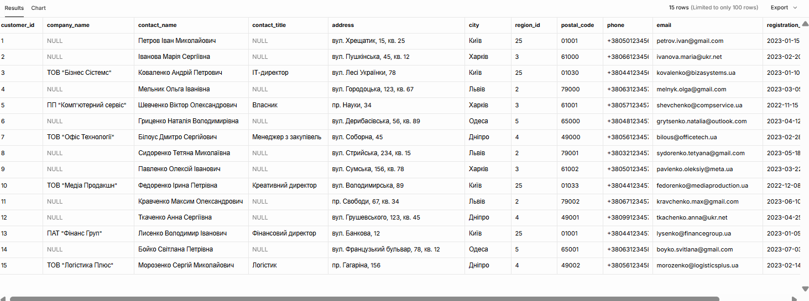
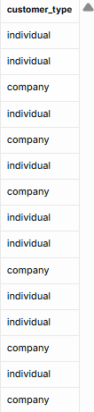


### 2. Вивести тільки назви товарів і їхні ціни з таблиці products

```sql
SELECT product_name, unit_price
FROM products;
```

Результат: Отримано усіх 25 товарів із таблиці products із зазначенням їхньої назви та ціни.

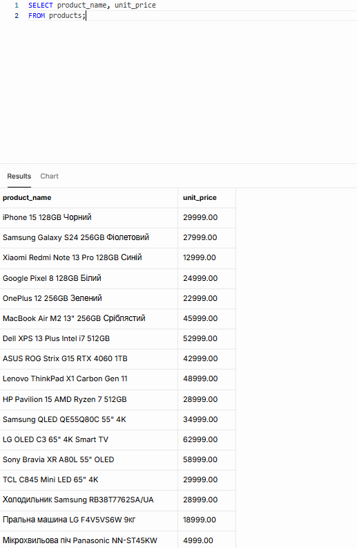
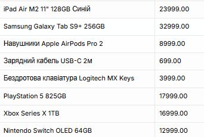

### 3. Показати контактні дані всіх співробітників

```sql
SELECT first_name, last_name, phone, email
FROM employees;
```

Результат: Отримано контактні дані (ім'я, прізвище, телефон та email) усіх 8 співробітників компанії.

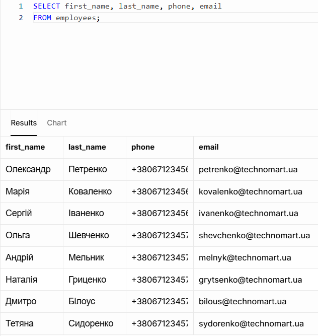

## Прості умови WHERE

### 4. Клієнти з міста Київ

```sql
SELECT * FROM customers
WHERE city = 'Київ';
```

Результат: Знайдено 4 клієнтів із міста Київ.

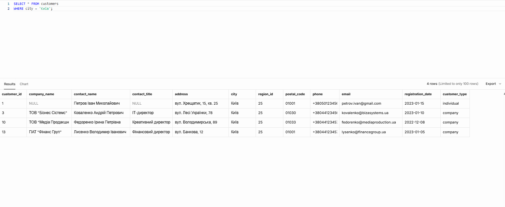

### 5. Товари дорожчі за 25000 грн

```sql
SELECT * FROM products
WHERE unit_price > 25000;
```

Результат: Знайдено 12 товарів, вартість яких перевищує 25 000 грн.

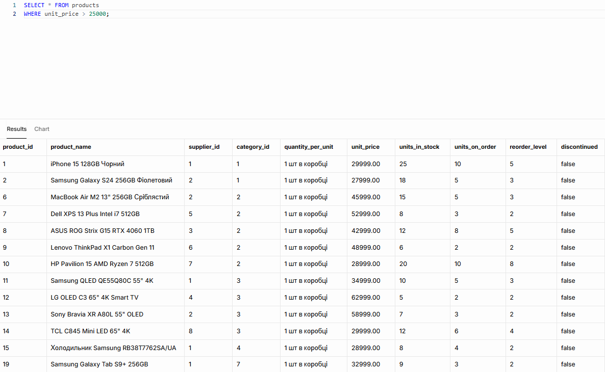

### 6. Замовлення зі статусом 'delivered'

```sql
SELECT * FROM orders 
WHERE order_status = 'delivered';
```

Результат: Знайдено 26 замовлень зі статусом 'delivered'.


### 7. Співробітники відділу продажів

```sql
SELECT * FROM employees 
WHERE title ILIKE '%продаж%';
```

Результат: Знайдено 3 співробітників, посада яких належить до відділу продажів («Менеджер з продажів»).

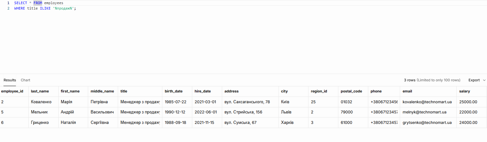

## Базове сортування ORDER BY

### 8. Товари за зростанням ціни

```sql
SELECT product_name, unit_price FROM products
ORDER BY unit_price ASC;
```

Результат: Отримано список усіх товарів, відсортований за зростанням ціни (від найдешевшого до найдорожчого).

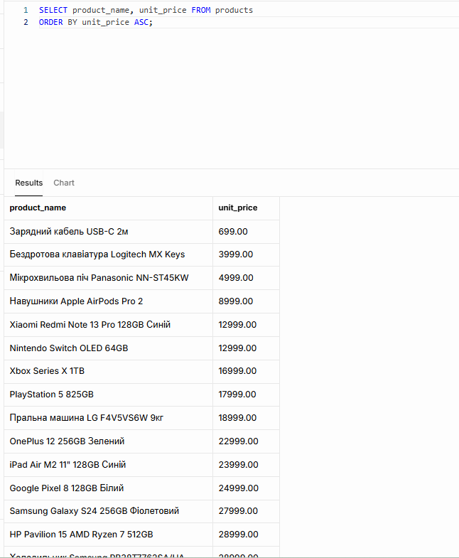

### 9. Клієнти в алфавітному порядку

```sql
SELECT contact_name, city FROM customers
ORDER BY contact_name ASC;
```

Результат: Отримано список контактних осіб клієнтів та їхніх міст, відсортований за алфавітом за ім'ям контактної особи.

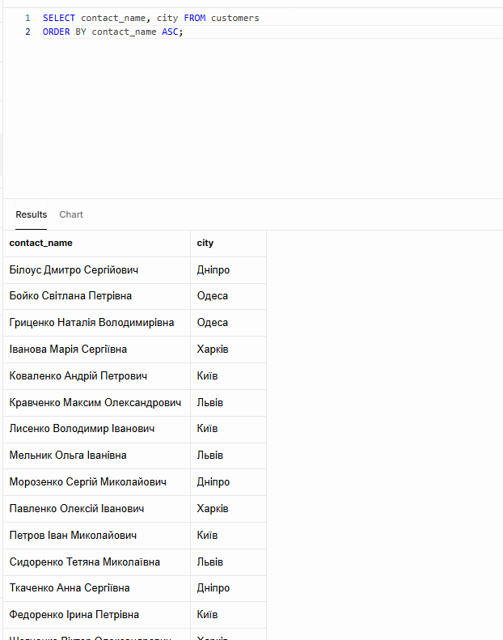

### 10. Замовлення від найновіших до найстаріших

```sql
SELECT * FROM orders
ORDER BY order_date DESC;
```

Результат: Отримано список усіх 31 замовлення, відсортований за датою створення від найновіших до найстаріших.

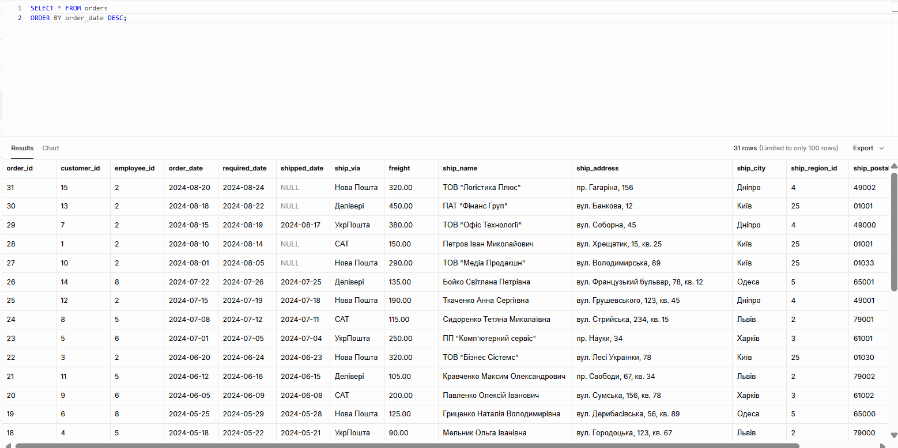

## Обмеження результатів LIMIT

### 11. Перші 10 найдорожчих товарів

```sql
SELECT product_name, unit_price FROM products
ORDER BY unit_price DESC
LIMIT 10;
```

Результат: Отримано топ-10 найдорожчих товарів, відсортованих за спаданням ціни.

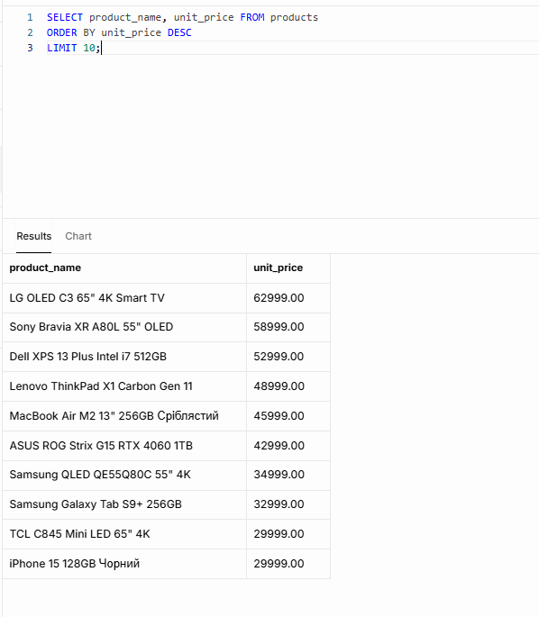

### 12. 5 останніх замовлень

```sql
SELECT * FROM orders
ORDER BY order_date DESC
LIMIT 5;
```

Результат: Отримано 5 найновіших замовлень, відсортованих за датою у зворотному порядку.

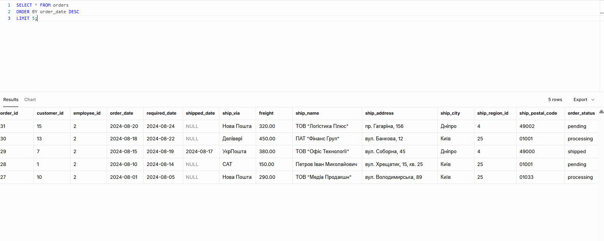

### 13. Перші 8 клієнтів в алфавітному порядку

```sql
SELECT contact_name, city FROM customers
ORDER BY contact_name ASC
LIMIT 8;
```

Результат: Отримано перших 8 контактних осіб клієнтів та їхніх міст, відсортованих за алфавітом.

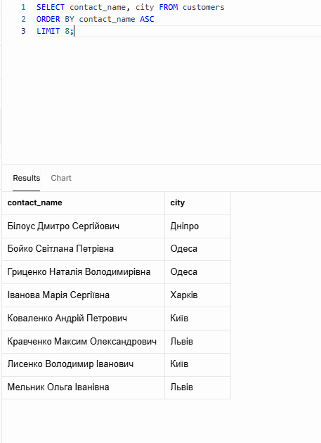

---

# РІВЕНЬ 2

## Пошук за зразком LIKE

### 14. Клієнти, чиї імена починаються на "Іван"

```sql
SELECT * FROM customers
WHERE contact_name LIKE 'Іван%';
```

Результат: Знайдено 1 клієнта, контактне ім'я якого починається на «Іван».

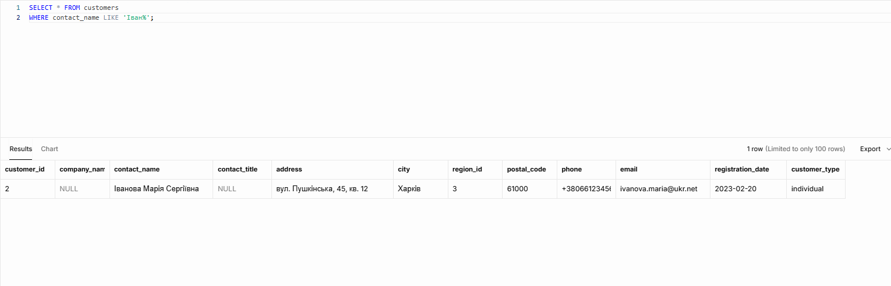

### 15. Товари зі словом "phone" або "телефон" у назві

```sql
SELECT * FROM products
WHERE product_name ILIKE '%phone%' OR product_name ILIKE '%телефон%';
```

Результат: Знайдено 1 товар, у назві якого міститься слово «phone» або «телефон».

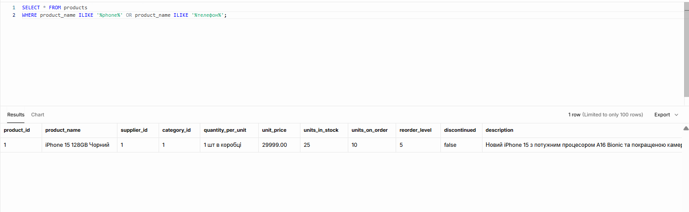

### 16–18. Самостійні запити з LIKE

```sql
-- Бізнес-логіка: маркетингу потрібен список клієнтів на прізвище "-енко"
-- для сегментованої розсилки (типове українське прізвище)
SELECT contact_name, email FROM customers
WHERE contact_name LIKE '%енко%';

Результат: Отримано імя та email 10 клієнтів, чиє прізвище містить закінчення «енко».

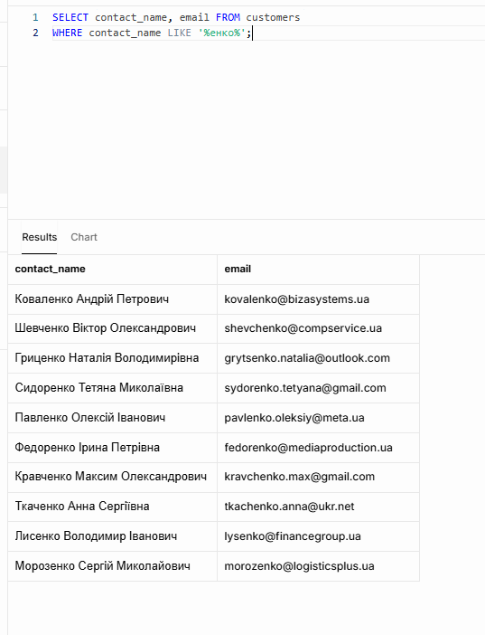


-- Бізнес-логіка: пошук усіх клієнтів з корпоративною поштою Gmail,
-- щоб оцінити частку клієнтів, які використовують безкоштовні поштові сервіси
SELECT contact_name, email FROM customers
WHERE email LIKE '%@gmail.com';

Результат: Отримано імя та email 5 клієнтів, чия електронна пошта зареєстрована на домені gmailcom.

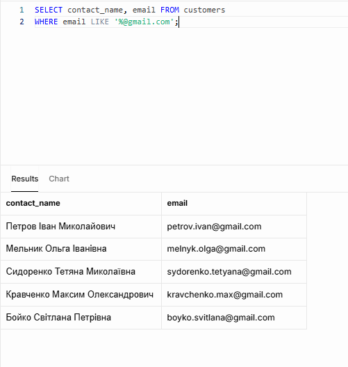


-- Бізнес-логіка: пошук товарів бренду Samsung для формування
-- окремого розділу каталогу
SELECT product_name, unit_price FROM products
WHERE product_name LIKE '%Samsung%';
```
Результат: Отримано назву та ціну 4 товарів бренду Samsung.

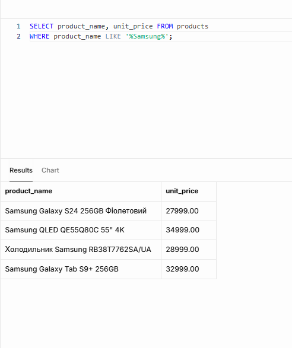

## Логічні оператори AND, OR, NOT

### 19. Товари дорожчі за 15000 і дешевші за 50000 грн

```sql
SELECT * FROM products
WHERE unit_price > 15000 AND unit_price < 50000;
```

Результат: Отримано список із 16 товарів, ціна яких становить більше 15 000 грн та менше 50 000 грн.

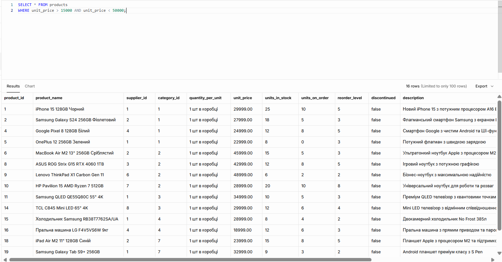

### 20. Клієнти з Києва або Львова, юридичні особи

```sql
SELECT * FROM customers
WHERE (city = 'Київ' OR city = 'Львів') AND customer_type = 'company';
```

Результат: Отримано 3 клієнти типу «company», які зареєстровані в Києві або Львові.

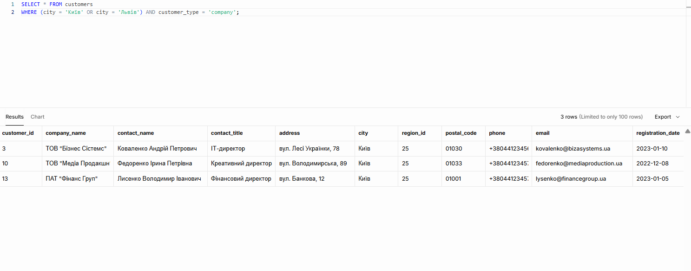

### 21–24. Самостійні запити з логічними операторами

```sql
-- Бізнес-логіка: знайти товари, що закінчуються (мало на складі),
-- але при цьому не зняті з виробництва — кандидати на дозамовлення
SELECT product_name, units_in_stock FROM products
WHERE units_in_stock < 5 AND NOT discontinued;

Результат: Отримано 1 товар (PlayStation 5 825GB), кількість якого на складі менша за 5 одиниць і який не знято з продажу (NOT discontinued).

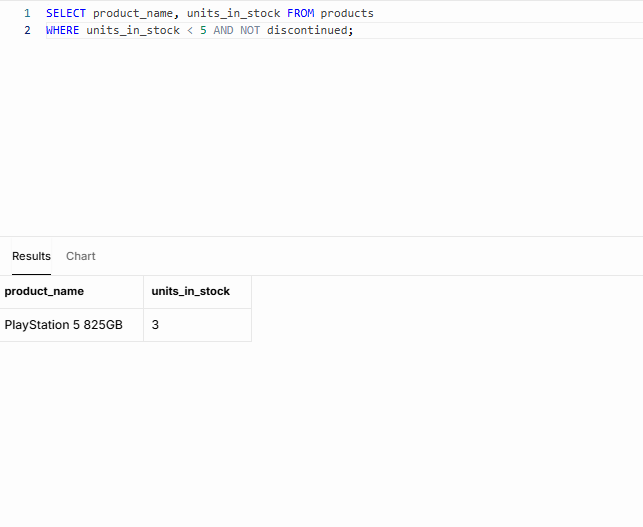

-- Бізнес-логіка: замовлення, які або ще не доставлені, або скасовані —
-- потребують уваги менеджера
SELECT * FROM orders
WHERE order_status = 'pending' OR order_status = 'cancelled';

Результат: Отримано 2 замовлення, які мають статус «pending» або «cancelled».

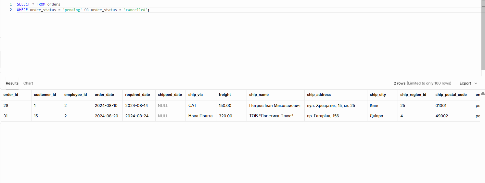

-- Бізнес-логіка: фізичні особи (немає назви компанії) з великих міст —
-- цільова аудиторія для роздрібних акцій
SELECT contact_name, city FROM customers
WHERE company_name IS NULL AND (city = 'Київ' OR city = 'Харків');

Результат: Отримано 3 приватні особи (де company_name IS NULL), які проживають у Києві або Харкові.

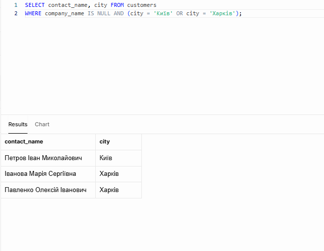

-- Бізнес-логіка: співробітники, які НЕ є керівниками (мають reports_to) —
-- список для розсилки навчальних матеріалів для лінійного персоналу
SELECT first_name, last_name FROM employees
WHERE reports_to IS NOT NULL AND NOT title LIKE '%директор%';
```

Результат: Отримано 7 працівників, які мають керівника (reports_to IS NOT NULL) і посада яких не містить слова «директор»

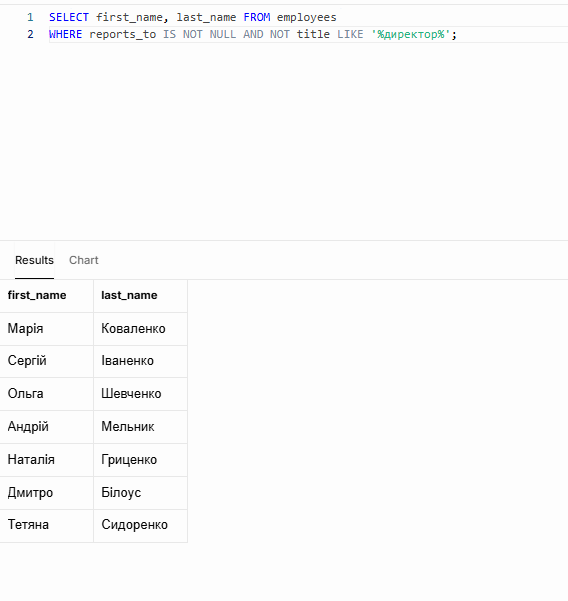

## Оператори IN, BETWEEN, IS NULL

### 25. Клієнти з міст Київ, Харків, Одеса, Дніпро

```sql
SELECT * FROM customers
WHERE city IN ('Київ', 'Харків', 'Одеса', 'Дніпро');
```

Результат: Отримано 12 клієнтів, які зареєстровані в одному з міст: Київ, Харків, Одеса або Дніпро.

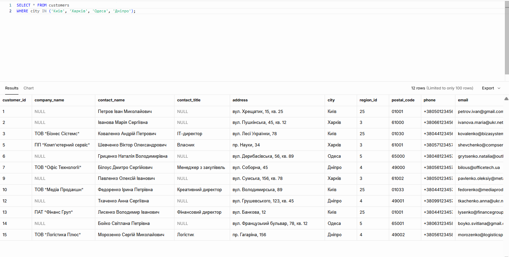


### 26. Товари в ціновому діапазоні від 10000 до 30000 грн

```sql
SELECT * FROM products
WHERE unit_price BETWEEN 10000 AND 30000;
```

Результат: Отримано 13 товарів, ціна яких знаходиться в діапазоні від 10 000 грн до 30 000 грн включно.

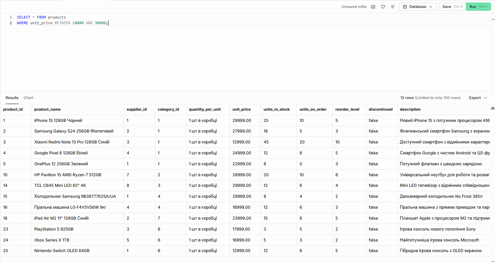

### 27–32. Самостійні запити (по 2 на IN, BETWEEN, IS NULL)

```sql
-- IN: бізнес-логіка — вибрати замовлення у ключових статусах для звіту логістики
SELECT * FROM orders
WHERE order_status IN ('shipped', 'delivered');

Результат: Отримано 27 замовлень, які мають статус «shipped» або «delivered».

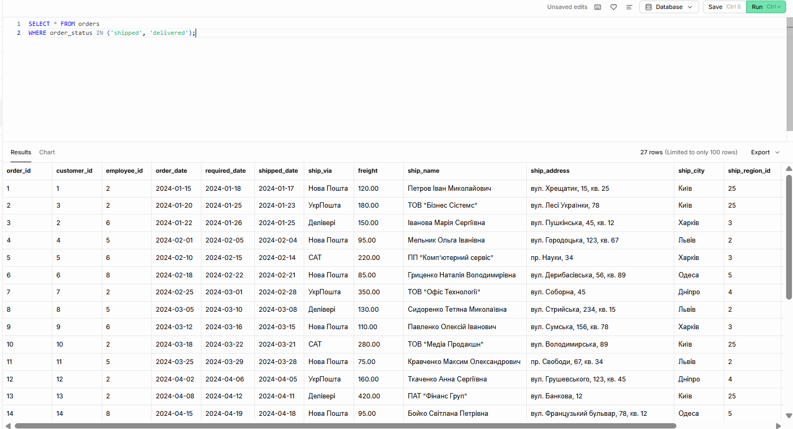

-- IN: бізнес-логіка — товари з обраних категорій для промо-акції
SELECT product_name, category_id FROM products
WHERE category_id IN (1, 2, 3);

Результат: Отримано назву та ID категорії для 14 товарів, які належать до категорій 1, 2 або 3.

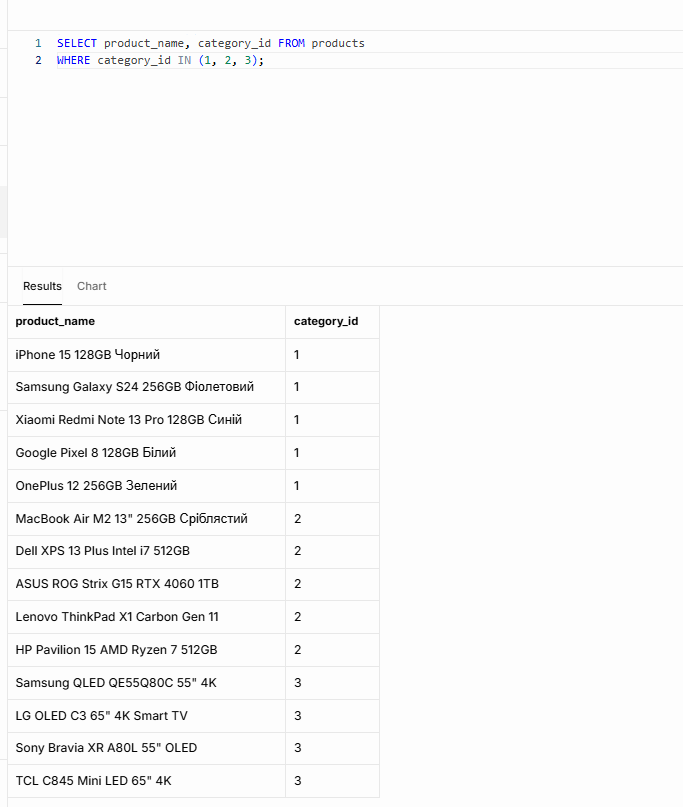


-- BETWEEN: бізнес-логіка — замовлення за 2024 рік для річного звіту
SELECT * FROM orders
WHERE order_date BETWEEN '2024-01-01' AND '2024-12-31';

Результат: Отримано 31 замовлення, оформлене впродовж 2024 року (з 1 січня по 31 грудня 2024 року включно).

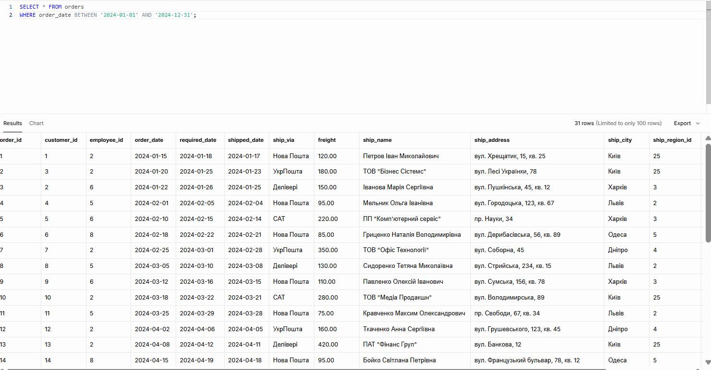


-- BETWEEN: бізнес-логіка — товари середнього цінового сегмента для аналізу маржі
SELECT product_name, unit_price FROM products
WHERE unit_price BETWEEN 5000 AND 15000;

Результат: Отримано назву та ціну 3 товарів, вартість яких знаходиться в діапазоні від 5 000 грн до 15 000 грн включно.

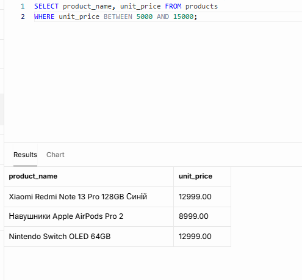


-- IS NULL: бізнес-логіка — замовлення, які ще не відправлені (потребують дії складу)
SELECT order_id, order_date FROM orders
WHERE shipped_date IS NULL;

Результат: Отримано номер та дату створення для 4 замовлень, які ще не були відправлені (shipped_date IS NULL).

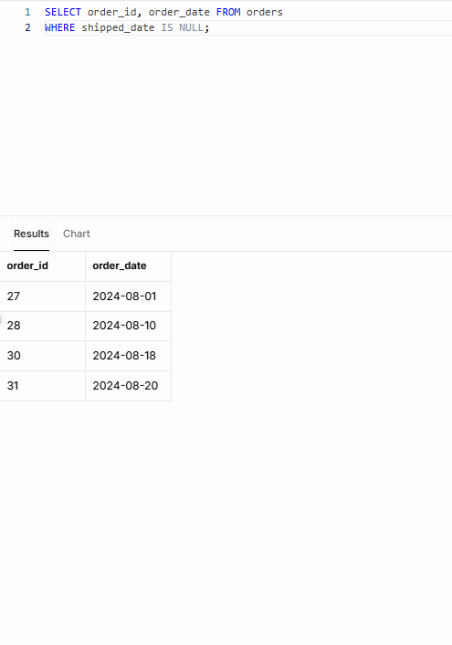


-- IS NOT NULL: бізнес-логіка — товари з заповненим описом (готові до публікації в каталозі)
SELECT product_name FROM products
WHERE description IS NOT NULL;
```

Результат: Отримано назву товарів, у яких наявний опис (description IS NOT NULL).

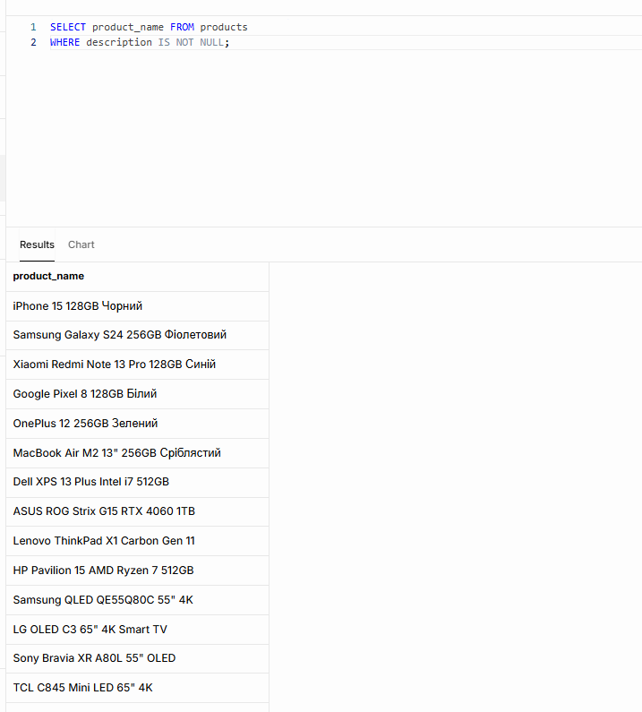

## Комбінування умов (5 самостійних запитів)

```sql
-- 1. Бізнес-логіка: телефони з Apple або Samsung у середньому ціновому
-- сегменті — для акції "середній клас"
SELECT product_name, unit_price FROM products
WHERE (product_name LIKE '%Apple%' OR product_name LIKE '%Samsung%')
  AND unit_price BETWEEN 10000 AND 40000;

Результат: Отримано назву та ціну 4 товарів брендів Apple або Samsung, ціна яких знаходиться в діапазоні від 10 000 грн до 40 000 грн включно.

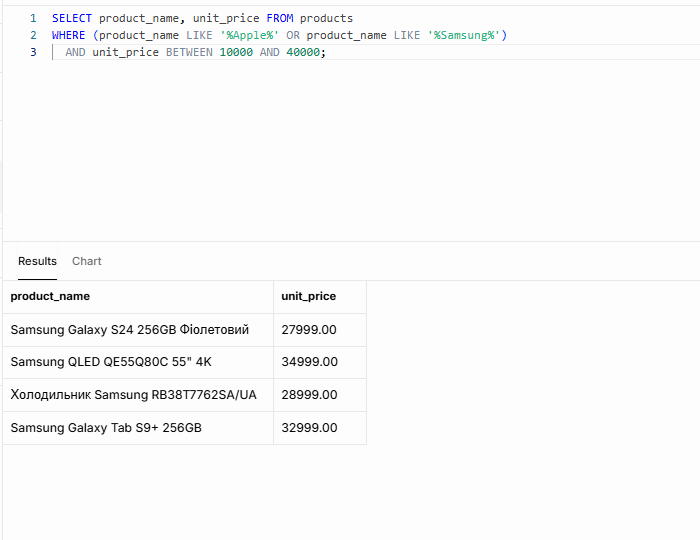


-- 2. Бізнес-логіка: клієнти з великих міст, які є юр. особами
-- та мають заповнений email — для B2B email-розсилки
SELECT contact_name, city, email FROM customers
WHERE city IN ('Київ', 'Харків', 'Одеса')
  AND customer_type = 'company'
  AND email IS NOT NULL;

Результат: Отримано контактне імя, місто та електронну пошту для 4 корпоративних клієнтів (customer_type = 'company'), які мають вказаний email і проживають у Києві, Харкові або Одесі.

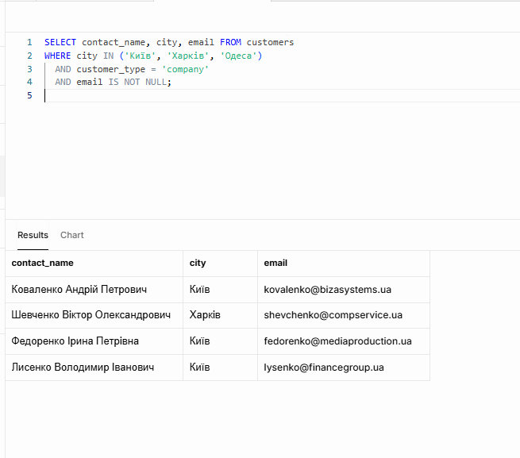


-- 3. Бізнес-логіка: замовлення у діапазоні дат зі статусом "доставлено"
-- або "відправлено" — для звіту виконання за квартал
SELECT * FROM orders
WHERE order_date BETWEEN '2024-04-01' AND '2024-06-30'
  AND order_status IN ('delivered', 'shipped');

Результат: Отримано 11 замовлень, оформлених у другому кварталі 2024 року (з 1 квітня по 30 червня), зі статусом «delivered» або «shipped».

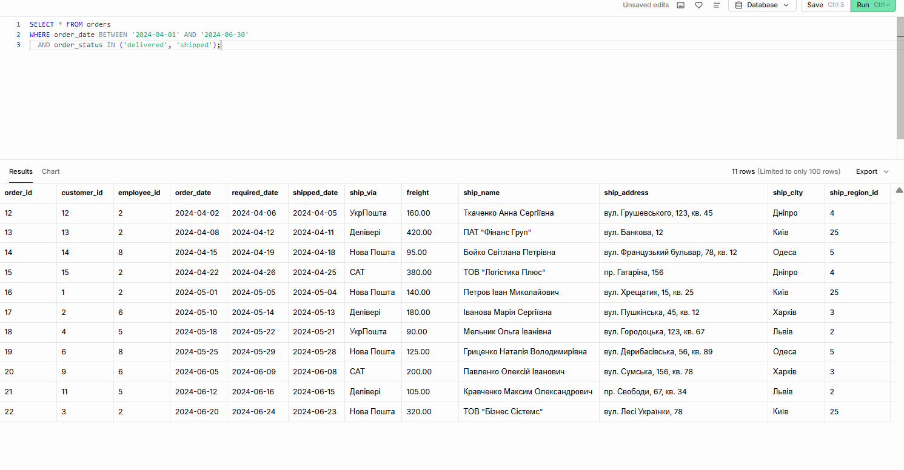


-- 4. Бізнес-логіка: товари, що НЕ є аксесуарами (без "чохол"/"кабель")
-- і при цьому дорогі — для VIP-каталогу
SELECT product_name, unit_price FROM products
WHERE unit_price > 30000
  AND product_name NOT LIKE '%чохол%'
  AND product_name NOT LIKE '%кабель%';

Результат: Отримано назву та ціну 8 товарів дорожчих за 30 000 грн, у назві яких відсутні слова «чохол» та «кабель».

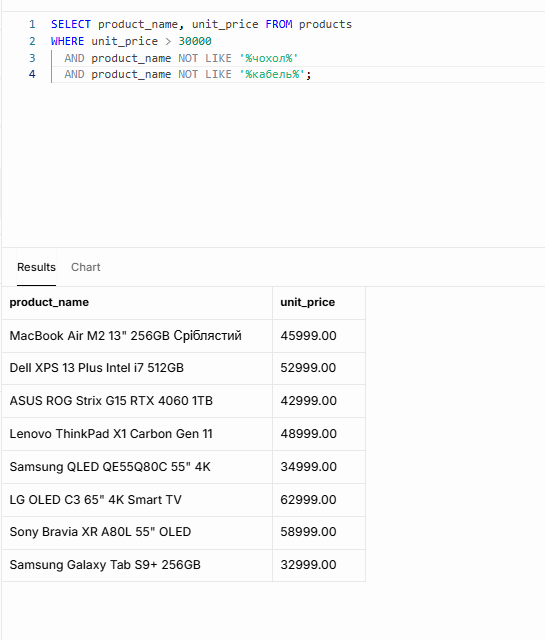


-- 5. Бізнес-логіка: співробітники відділу продажів без вказаного
-- телефону — потрібно доповнити контактні дані
SELECT first_name, last_name FROM employees
WHERE title LIKE '%продаж%' AND phone IS NULL;
```

Результат: в таблиці відсутні співробітники, посада яких містить «продаж» і при цьому не вказано номер телефону


## Складне сортування та пагінація

```sql
-- 1. Бізнес-логіка: каталог товарів, згрупований за категоріями,
-- у межах категорії — від дорожчих до дешевших
SELECT product_name, category_id, unit_price FROM products
ORDER BY category_id ASC, unit_price DESC;

Результат: Отримано назву, ID категорії та ціну товарів, відсортованих за зростанням ID категорії (category_id ASC), а в межах кожної категорії — за спаданням ціни (unit_price DESC).

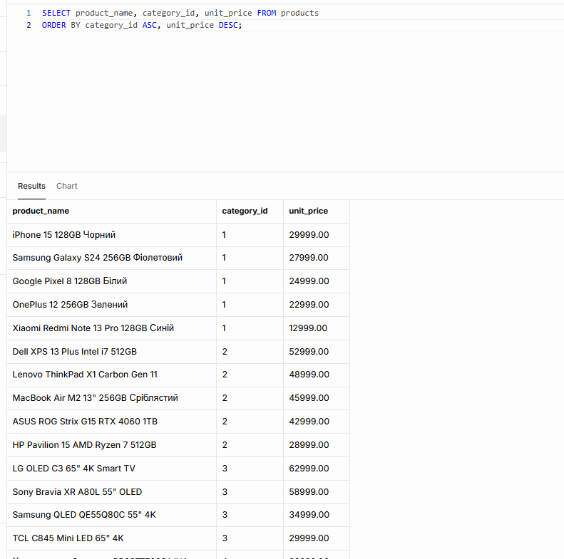


-- 2. Бізнес-логіка: клієнти, впорядковані за типом (спочатку компанії),
-- потім за містом і за ім'ям — для структурованого звіту продажів
SELECT contact_name, customer_type, city FROM customers
ORDER BY customer_type DESC, city ASC, contact_name ASC;

Результат: Отримано контактне імя, тип клієнта та місто для клієнтів, відсортованих за спаданням типу клієнта (customer_type DESC), за зростанням міста (city ASC) та за зростанням контактного імені (contact_name ASC).

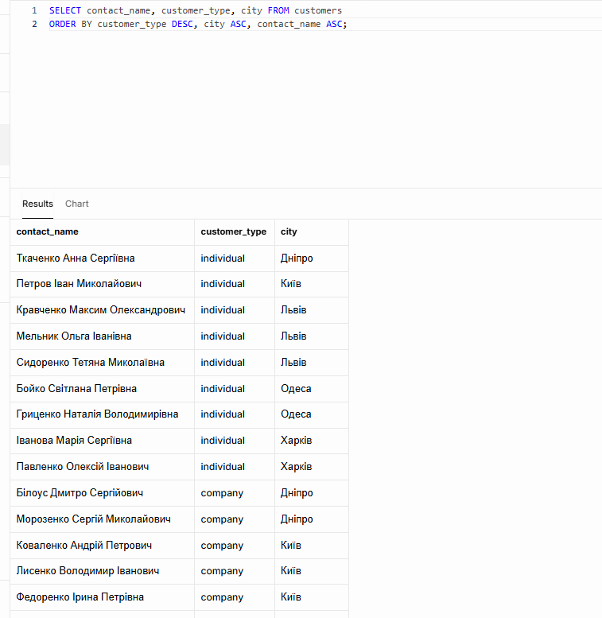


-- 3. Бізнес-логіка: замовлення за спаданням дати, при однаковій даті —
-- за статусом, для хронологічного журналу подій
SELECT * FROM orders
ORDER BY order_date DESC, order_status ASC;

Результат: Отримано всі 31 запис із таблиці orders, відсортовані за спаданням дати замовлення (order_date DESC) та за зростанням статусу замовлення (order_status ASC).

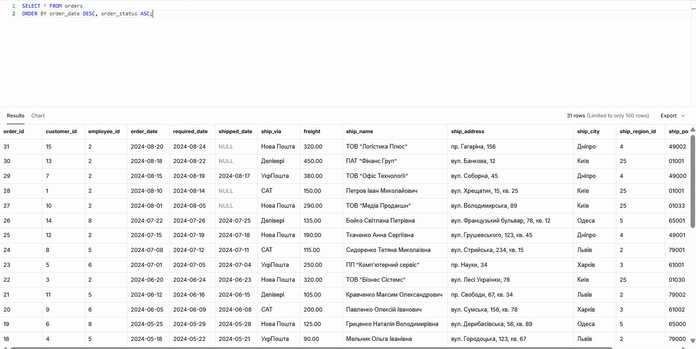


-- 4. Пагінація: сторінка 2 каталогу товарів (по 10 на сторінку)
SELECT product_name, unit_price FROM products
ORDER BY product_name
LIMIT 10 OFFSET 10;

Результат: Отримано назви та ціни 10 товарів із другої сторінки списку (товари з 11 по 20), відсортовані за алфавітом (ORDER BY product_name із застосуванням LIMIT 10 OFFSET 10).

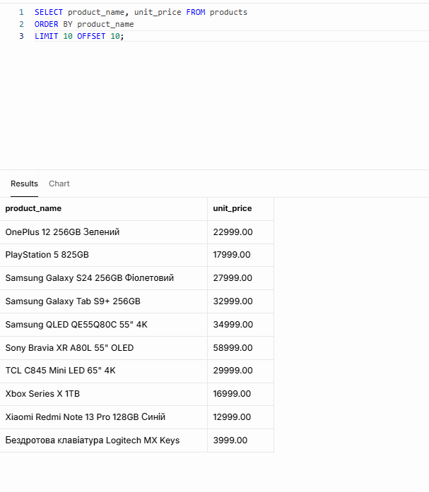


-- 5. Пагінація: сторінка 3 списку клієнтів (по 5 на сторінку)
SELECT contact_name, city FROM customers
ORDER BY contact_name
LIMIT 5 OFFSET 10;
```

Результат: Отримано контактні імена та міста 5 клієнтів (з 11 по 15 запис), відсортованих за алфавітом за контактним ім'ям (ORDER BY contact_name із застосуванням LIMIT 5 OFFSET 10).

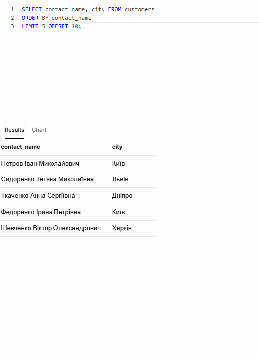

---

# РІВЕНЬ 3

## Складні комбінації LIKE з логічними операторами

### 33. Товари Samsung або Apple, без слова "чохол"

```sql
SELECT * FROM products
WHERE (product_name LIKE '%Samsung%' OR product_name LIKE '%Apple%')
  AND product_name NOT LIKE '%чохол%';
```

Результат: Отримано всі поля для 5 товарів бренду Samsung або Apple, у назві яких відсутнє слово «чохол».

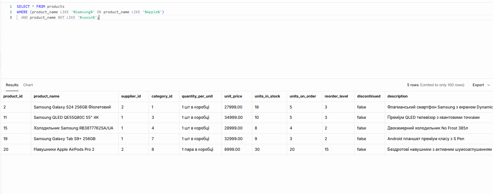

### 34–37. Самостійні складні запити з LIKE

```sql
-- 1. Бізнес-логіка: клієнти з поштою на gmail або outlook,
-- окрім тестових акаунтів — чиста база для email-маркетингу
SELECT contact_name, email FROM customers
WHERE (email LIKE '%@gmail.com' OR email LIKE '%@outlook.com')
  AND contact_name NOT LIKE '%тест%';

Результат: Отримано контактні імена та електронні пошти для 6 клієнтів, які використовують поштові сервіси gmail.com або outlook.com, та у контактному імені яких відсутнє слово «тест».

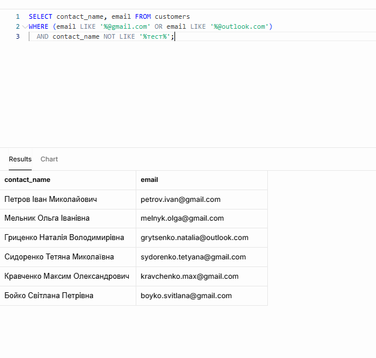


-- 2. Бізнес-логіка: товари з категорії "телефони", що не є
-- б/у чи відновленими — тільки новий товар у каталог
SELECT product_name FROM products
WHERE (product_name ILIKE '%phone%' OR product_name ILIKE '%смартфон%')
  AND product_name NOT ILIKE '%refurb%'
  AND product_name NOT ILIKE '%б/у%';

Результат: Отримано назву 1 товару, яка містить «phone» або «смартфон» без урахування регістру (ILIKE), за винятком відновлених товарів та товарів з позначкою «б/в».

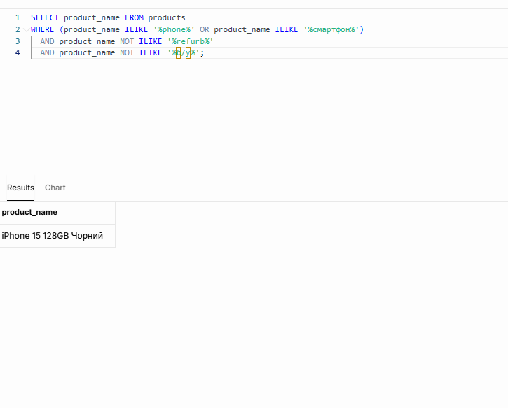


-- 3. Бізнес-логіка: співробітники на керівних посадах (менеджер/директор),
-- крім відділу продажів — для наради топ-менеджменту без sales-команди
SELECT first_name, last_name, title FROM employees
WHERE (title LIKE '%менеджер%' OR title LIKE '%директор%')
  AND title NOT LIKE '%продаж%';

Результат: Отримано імя, прізвище та посаду 1 співробітника, посада якого містить «менеджер» або «директор», за винятком посад, повязаних із продажами.

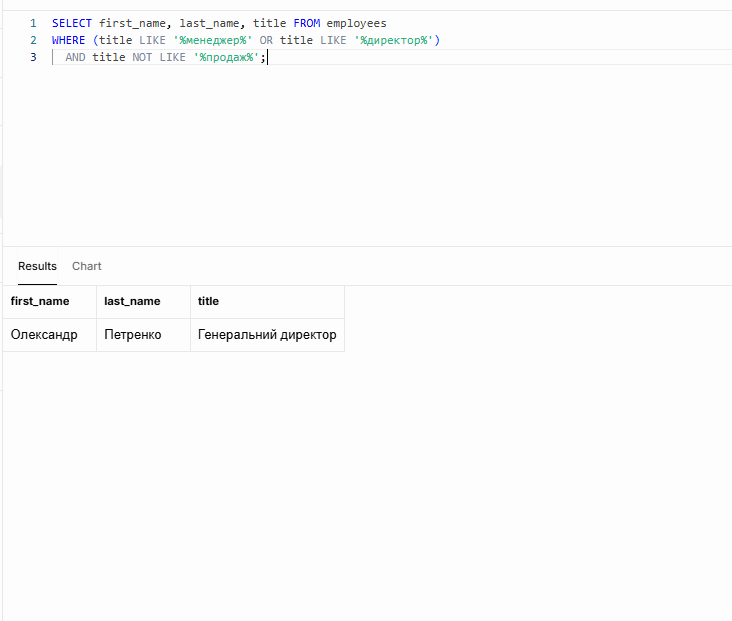


-- 4. Бізнес-логіка: клієнти на "О" або "І", які не є компаніями —
-- вибірка фізосіб для персоналізованої розсилки за алфавітом
SELECT contact_name FROM customers
WHERE (contact_name LIKE 'О%' OR contact_name LIKE 'І%')
  AND company_name IS NULL;
```

Результат: Отримано контактне ім'я 1 клієнта, ім'я якого починається на літеру «О» або «І» та для якого відсутня назва компанії (company_name IS NULL).

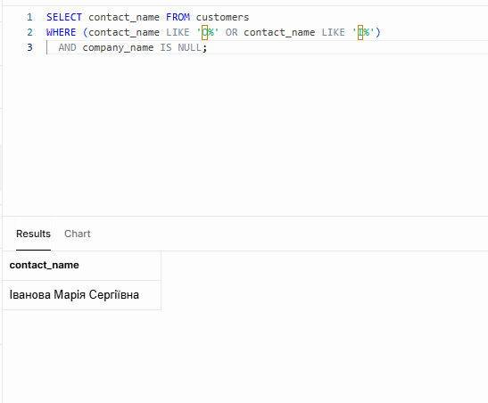

## Вкладені логічні умови

### 38. Товари дорожчі 20000 (категорії 1 або 2) АБО дешевші 5000 будь-якої категорії

```sql
SELECT * FROM products
WHERE (unit_price > 20000 AND (category_id = 1 OR category_id = 2))
   OR unit_price < 5000;
```

Результат: Отримано всі поля для 12 товарів, які коштують понад 20 000 і належать до категорії 1 або 2, або ж мають ціну менше 5 000.

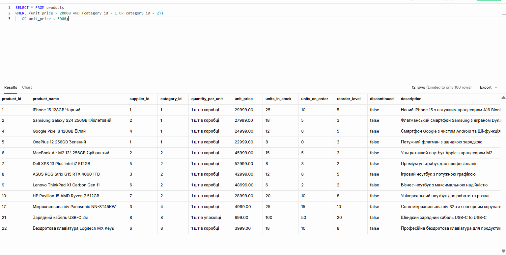

### 39–41. Самостійні запити з вкладеними умовами

```sql
-- 1. Бізнес-логіка: VIP-сегмент — компанії з великих міст з високим
-- чеком, АБО будь-який клієнт з нетиповою активністю (доставлені замовлення)
SELECT DISTINCT c.contact_name, c.city, c.customer_type
FROM customers c
WHERE (c.customer_type = 'company' AND c.city IN ('Київ', 'Харків'))
   OR c.customer_id IN (
       SELECT customer_id FROM orders WHERE order_status = 'delivered'
   );

Результат: Отримано контактні імена, міста та типи 15 клієнтів, які є компаніями з Києва чи Харкова або мають хоча б одне доставлене замовлення (order_status = 'delivered').

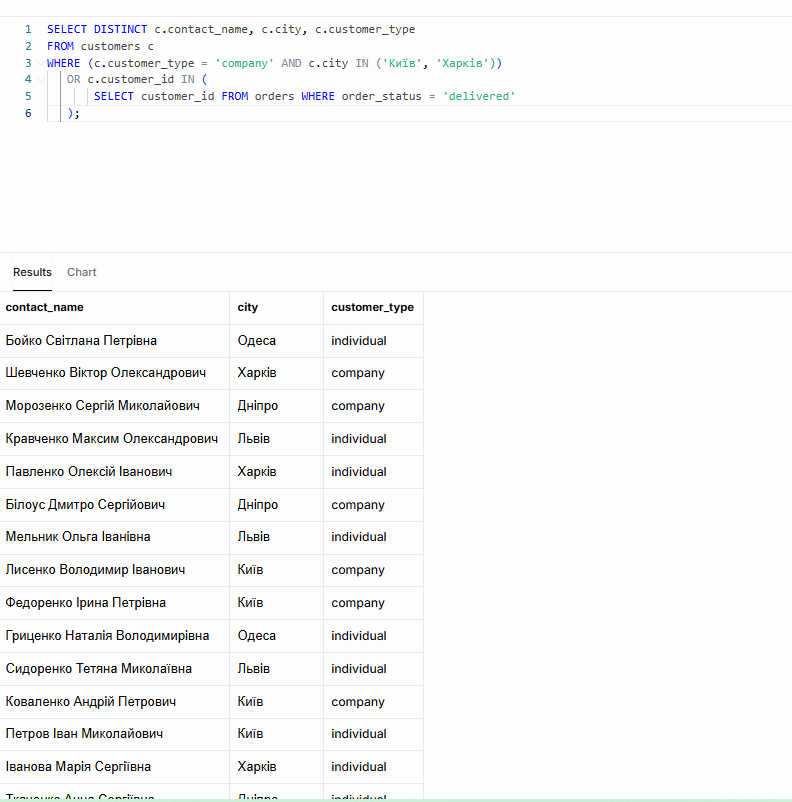


-- 2. Бізнес-логіка: товари для розпродажу — або застарілі (discontinued)
-- з будь-якою ціною, або активні, але з надлишком на складі
SELECT product_name, unit_price, units_in_stock FROM products
WHERE discontinued
   OR (NOT discontinued AND units_in_stock > 50);

Результат: Отримано назву, ціну та кількість на складі для 1 товару, який знято з продажу (discontinued = true) або який є в наявності у кількості понад 50 одиниць (units_in_stock > 50)

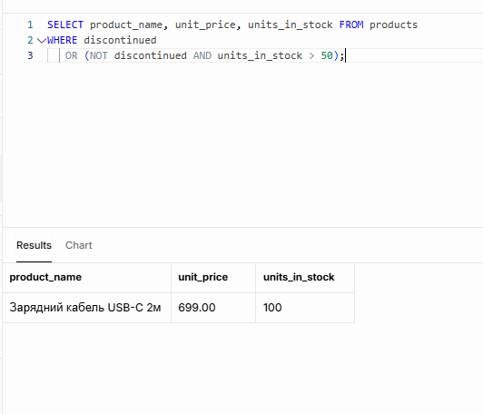


-- 3. Бізнес-логіка: замовлення для термінового опрацювання — прострочені
-- (стара дата, ще не відправлені) АБО скасовані нещодавно
SELECT * FROM orders
WHERE (order_date < '2024-06-01' AND shipped_date IS NULL)
   OR (order_status = 'cancelled' AND order_date > '2024-09-01');
```

Результат: Отримано порожній результат (0 рядків) для замовлень, створених до 1 червня 2024 року та не відправлених, або скасованих після 1 вересня 2024 року.

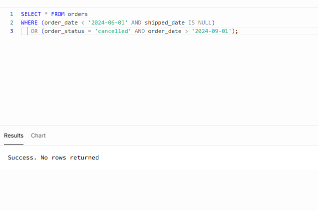

## Комплексні аналітичні запити

```sql
-- Звіт товарів із 5+ умовами фільтрації:
-- активні, в наявності, середньо-високий сегмент, не аксесуари,
-- у пріоритетних категоріях
SELECT product_name, unit_price, units_in_stock, category_id
FROM products
WHERE NOT discontinued
  AND units_in_stock > 0
  AND unit_price BETWEEN 15000 AND 60000
  AND product_name NOT LIKE '%чохол%'
  AND product_name NOT LIKE '%кабель%'
  AND category_id IN (1, 2, 3)
ORDER BY unit_price DESC;

Результат: Отримано назви, ціни, кількість на складі та ідентифікатори категорій для 12 товарів, які не зняті з продажу, є в наявності (units_in_stock > 0), мають ціну від 15 000 до 60 000, належать до категорій 1, 2 або 3 і не містять у назві слів «чохол» та «кабель», відсортованих за спаданням ціни (ORDER BY unit_price DESC).

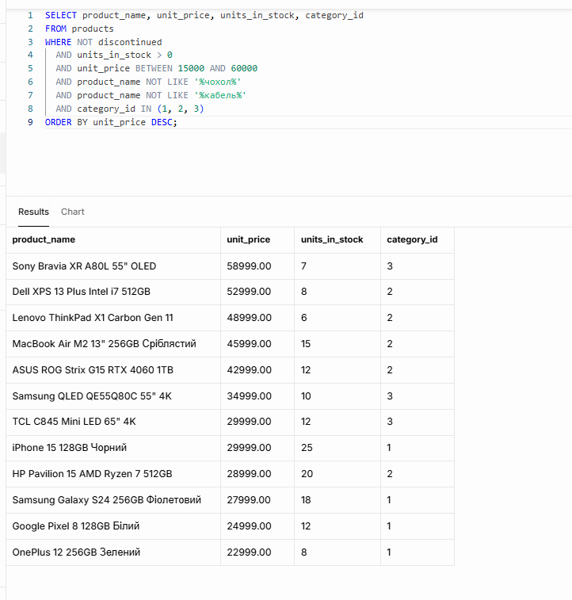


-- Аналіз клієнтської бази з множинними критеріями:
-- юрособи з великих міст з заповненим email, без тестових записів
SELECT contact_name, city, customer_type, email
FROM customers
WHERE customer_type = 'company'
  AND city IN ('Київ', 'Харків', 'Львів', 'Одеса')
  AND email IS NOT NULL
  AND contact_name NOT LIKE '%тест%'
ORDER BY city, contact_name;
```

Результат: Отримано контактні імена, міста, типи клієнтів та електронні пошти для 4 клієнтів-компаній (customer_type = 'company'), які знаходяться в Києві, Харкові, Львові або Одесі, мають вказаний email (email IS NOT NULL), та у контактному імені яких відсутнє слово «тест», відсортованих за містом та контактним ім'ям (ORDER BY city, contact_name).

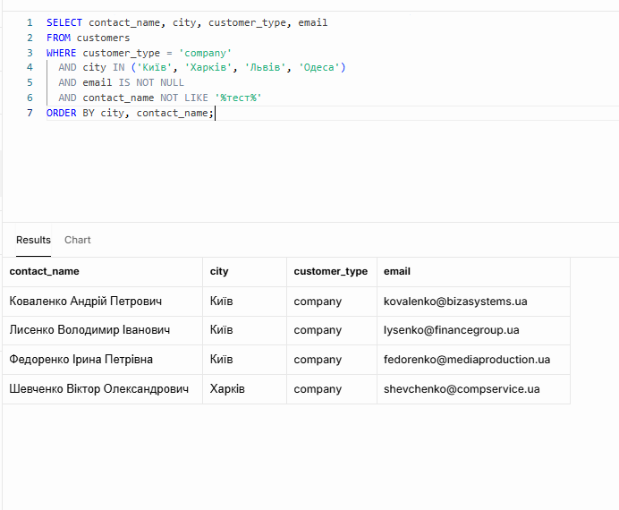

## Дослідження даних та пошук закономірностей

```sql
-- Аналіз товарів за ціновими сегментами
-- 1. Бюджетний сегмент
SELECT COUNT(*) AS кількість, 'Бюджетний (до 5000)' AS сегмент
FROM products WHERE unit_price < 5000;

Результат: Отримано загальну кількість (3 одиниці) та назву сегмента для товарів з ціною менше 5 000 (WHERE unit_price < 5000).

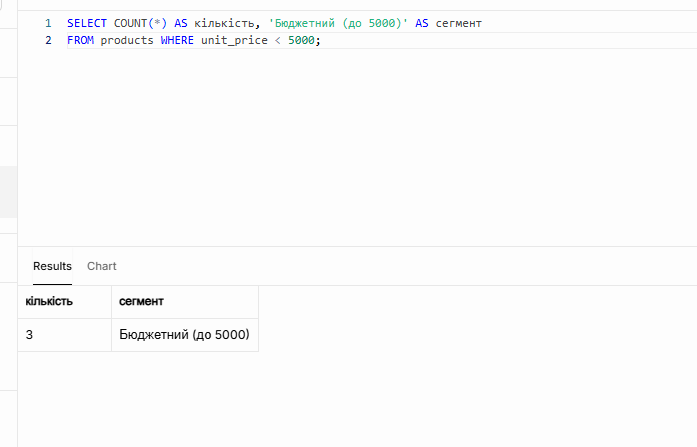

-- 2. Середній сегмент
SELECT COUNT(*) AS кількість, 'Середній (5000-20000)' AS сегмент
FROM products WHERE unit_price BETWEEN 5000 AND 20000;

Результат: Отримано загальну кількість (6 одиниць) та назву сегмента для товарів із цінового діапазону від 5 000 до 20 000 (WHERE unit_price BETWEEN 5000 AND 20000).

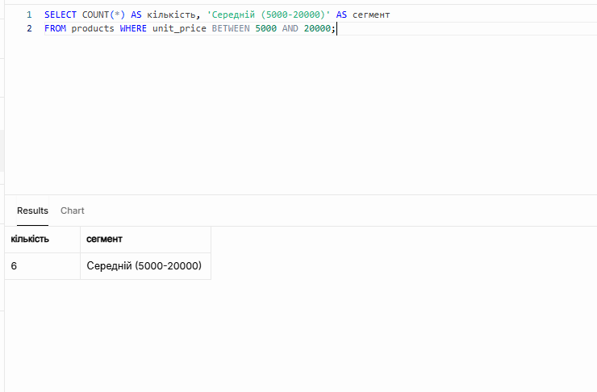


-- 3. Преміум сегмент
SELECT COUNT(*) AS кількість, 'Преміум (>20000)' AS сегмент
FROM products WHERE unit_price > 20000;

Результат: Отримано загальну кількість (16 одиниць) та назву сегмента для товарів з ціною понад 20 000 (WHERE unit_price > 20000).

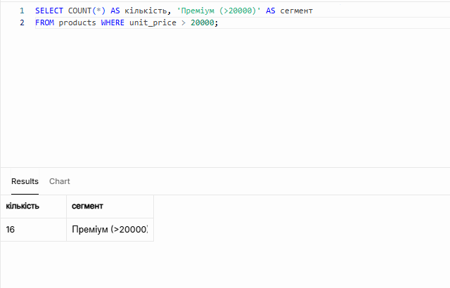


-- Дослідження розподілу клієнтів за географією
-- 1. Кількість клієнтів по містах
SELECT city, COUNT(*) AS кількість_клієнтів
FROM customers GROUP BY city ORDER BY кількість_клієнтів DESC;

Результат: Отримано перелік міст із кількістю клієнтів у кожному з них (усього 5 міст), відгрупований за містами та відсортований за спаданням кількості клієнтів (GROUP BY city ORDER BY кількість_клієнтів DESC).

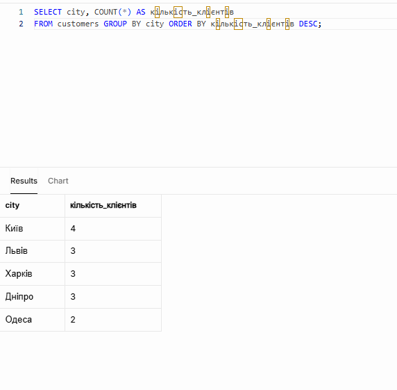


-- 2. Частка юридичних осіб у Києві
SELECT customer_type, COUNT(*) FROM customers
WHERE city = 'Київ' GROUP BY customer_type;

Результат: Отримано розподіл кількості клієнтів за їхніми типами (customer_type) для міста Київ, де 3 клієнти є компаніями (company) та 1 є фізичною особою (individual).

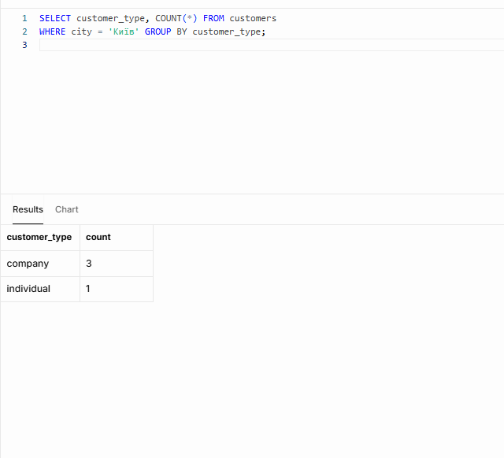


-- 3. Клієнти без вказаного міста (аномалія в даних)
SELECT * FROM customers WHERE city IS NULL;

Результат: Отримано порожній результат (0 рядків) для запиту клієнтів з неуказаним містом проживання (WHERE city IS NULL).

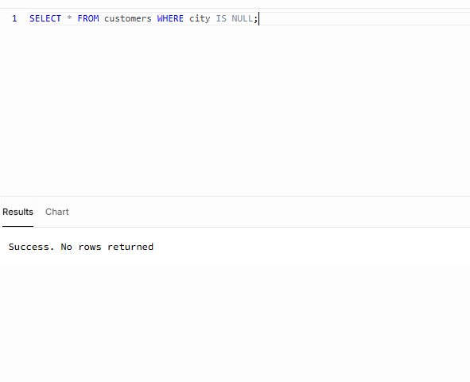


-- 4. Топ-5 міст за кількістю клієнтів
SELECT city, COUNT(*) AS кількість FROM customers
GROUP BY city ORDER BY кількість DESC LIMIT 5;

Результат: Отримано топ-5 міст із найбільшою кількістю клієнтів, відгрупований за містами та відсортований за спаданням кількості (GROUP BY city ORDER BY кількість DESC LIMIT 5).

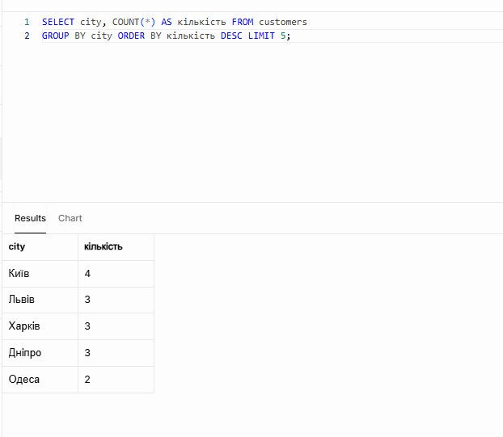


-- Аналіз часових патернів у замовленнях
-- 1. Замовлення по місяцях
SELECT DATE_TRUNC('month', order_date) AS місяць, COUNT(*) AS кількість
FROM orders GROUP BY місяць ORDER BY місяць;

Результат: Отримано розподіл кількості замовлень по місяцях за 2024 рік (8 місяців), відгрупований за допомогою DATE_TRUNC('month', order_date) та відсортований у хронологічному порядку (GROUP BY місяць ORDER BY місяць).

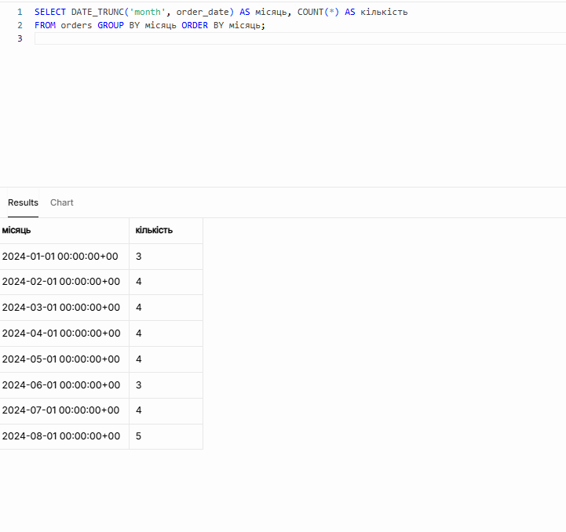


-- 2. Середній час від замовлення до відправки
SELECT AVG(shipped_date - order_date) AS середній_час_відправки
FROM orders WHERE shipped_date IS NOT NULL;

Результат: Отримано середній час відправки замовлень у днях (~2.96 дня) для всіх відправлених замовлень (AVG(shipped_date - order_date) WHERE shipped_date IS NOT NULL).

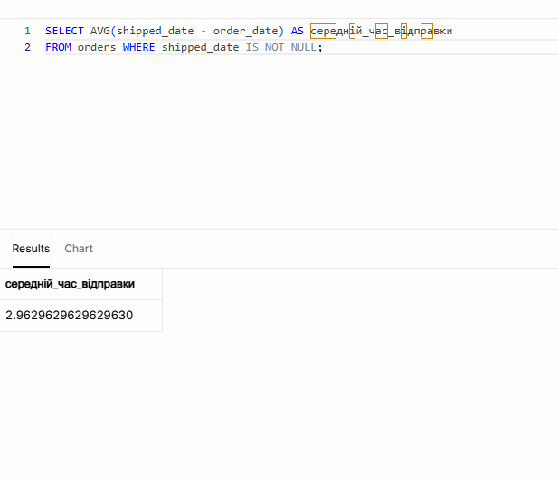


-- 3. Замовлення, що не відправлені понад 7 днів (проблемні)
SELECT * FROM orders
WHERE shipped_date IS NULL
  AND order_date < CURRENT_DATE - INTERVAL '7 days';
```

Результат: Отримано повні дані для 4 невідправлених замовлень (shipped_date IS NULL), які були оформлені більше ніж 7 днів тому від поточної дати (order_date < CURRENT_DATE - INTERVAL '7 days').

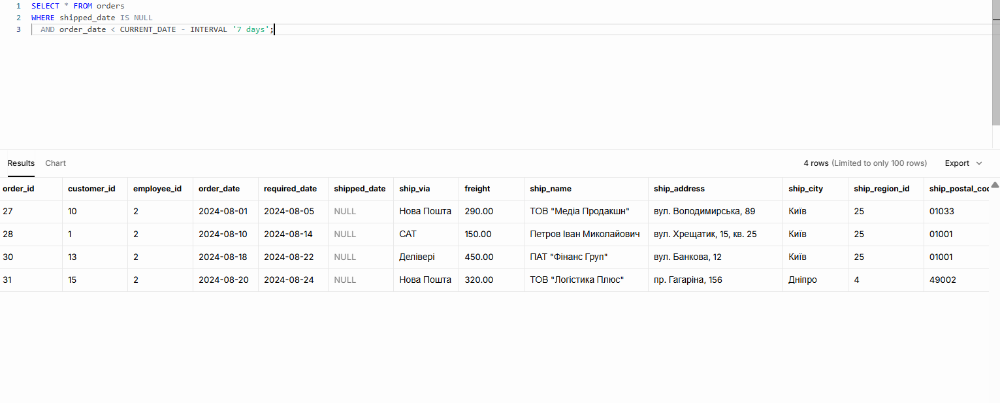

## Креативні завдання (5 нестандартних запитів)

```sql
-- 1. Бізнес-логіка: класифікація товарів за ціновою категорією "на льоту"
SELECT product_name, unit_price,
    CASE
        WHEN unit_price < 5000 THEN 'Бюджетний'
        WHEN unit_price < 20000 THEN 'Середній'
        WHEN unit_price < 50000 THEN 'Преміум'
        ELSE 'Люкс'
    END AS цінова_категорія
FROM products
ORDER BY unit_price DESC;

Результат: Отримано назви, ціни та згенеровані цінові категорії (цінова_категорія) для товарів із розподілом на «Бюджетний», «Середній», «Преміум» та «Люкс» за допомогою умовного виразу CASE, відсортованих за спаданням ціни (ORDER BY unit_price DESC).

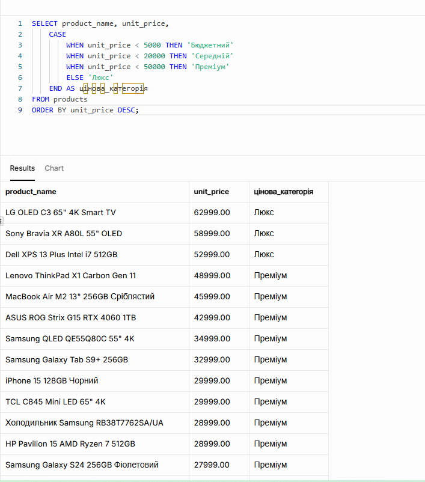


-- 2. Бізнес-логіка: сегментація клієнтів для CRM (VIP/звичайний/регіональний)
SELECT contact_name, city, customer_type,
    CASE
        WHEN customer_type = 'company' AND city = 'Київ' THEN 'VIP корпоративний'
        WHEN customer_type = 'company' THEN 'Корпоративний'
        WHEN city IN ('Київ', 'Харків', 'Львів') THEN 'Клієнт великого міста'
        ELSE 'Регіональний клієнт'
    END AS сегмент
FROM customers
ORDER BY сегмент;

Результат: Отримано контактні імена, міста, типи клієнтів та згенеровані сегменти (сегмент) для клієнтів із класифікацією на «VIP корпоративний», «Корпоративний», «Клієнт великого міста» та «Регіональний клієнт» за допомогою умовного виразу CASE, відсортованих за назвою сегмента (ORDER BY сегмент).

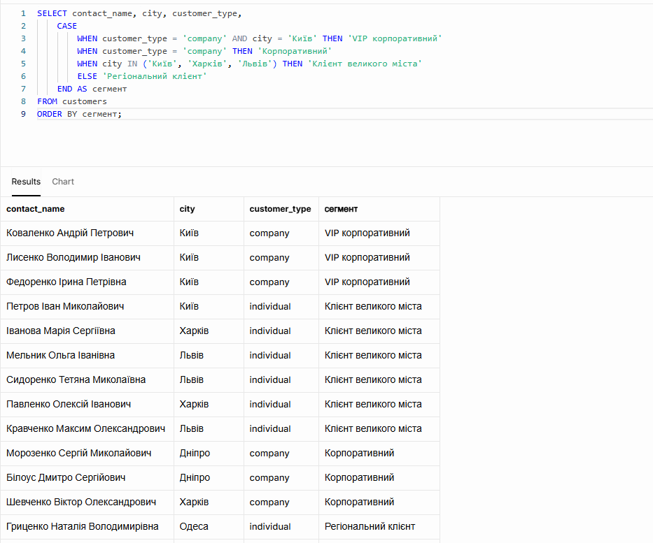


-- 3. Бізнес-логіка: розрахунок ціни з ПДВ та формування "гарної" назви для чеків
SELECT
    product_name || ' (' || category_id || ')' AS повна_назва,
    ROUND(unit_price * 1.2, 2) AS ціна_з_пдв
FROM products
ORDER BY ціна_з_пдв DESC
LIMIT 15;

Результат: Отримано перші 15 найдорожчих товарів із згенерованою повною назвою (повна_назва, що обєднує назву товару та ID категорії) та розрахованою ціною з урахуванням ПДВ 20% (ROUND(unit_price * 1.2, 2)), відсортованих за спаданням розрахованої ціни (ORDER BY ціна_з_пдв DESC LIMIT 15).

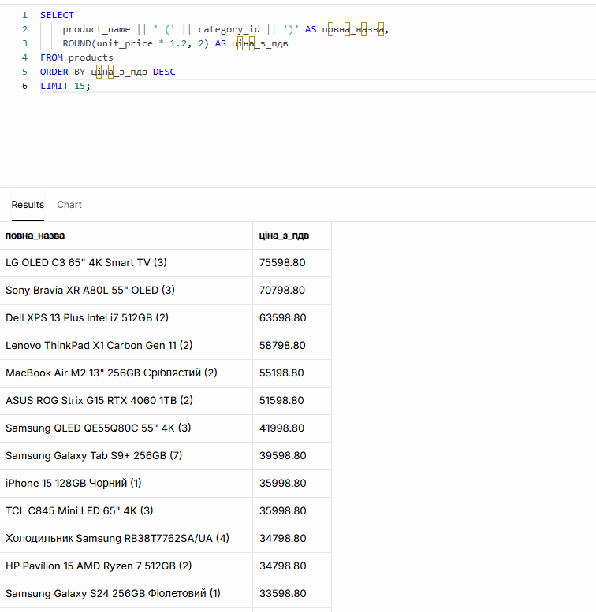


-- 4. Бізнес-логіка: пошук "проблемних" товарів — дорогі, але без опису
-- (низька конверсія в каталозі через брак інформації)
SELECT product_name, unit_price
FROM products
WHERE unit_price > 20000 AND COALESCE(description, '') = ''
ORDER BY unit_price DESC;

Результат: Отримано порожній результат (0 рядків) для запиту товарів із ціною понад 20 000 (unit_price > 20000), у яких відсутній або порожній опис (COALESCE(description, '') = ''), відсортованих за спаданням ціни.

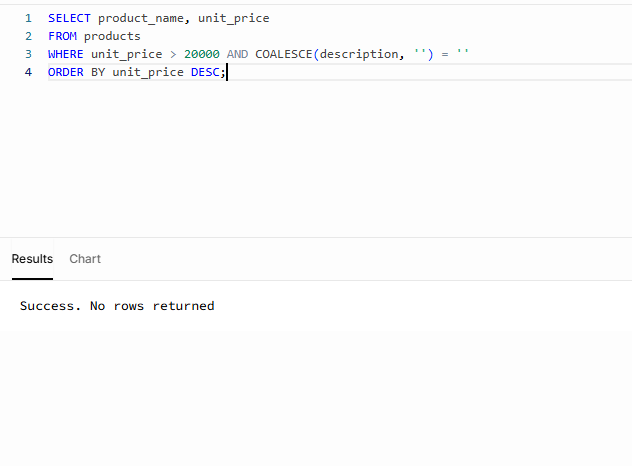


-- 5. Бізнес-логіка: топ-менеджери без прямого керівника (керівна верхівка)
-- разом з довжиною їхнього ПІБ (для форматування бейджів)
SELECT first_name, last_name,
    LENGTH(first_name || ' ' || last_name) AS довжина_імені
FROM employees
WHERE reports_to IS NULL
ORDER BY довжина_імені DESC;
```

Результат: Отримано ім'я, прізвище та кількість символів у повній назві (довжина_імені, 18 символів) для співробітника керівного рівня, який нікому не підпорядковується (WHERE reports_to IS NULL), відсортованих за спаданням довжини імені (ORDER BY довжина_імені DESC).

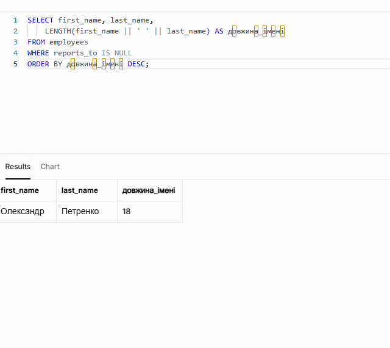

---

## Висновки

**Самооцінка**: 5

**Обгрунтування**: Виконано завдання рівнів 1, 2 і 3 у повному обсязі. Продемонстровано володіння базовими SELECT-запитами, фільтрацією WHERE (у тому числі LIKE/ILIKE, AND/OR/NOT, IN, BETWEEN, IS NULL), сортуванням ORDER BY (у тому числі багатоколонковим) та пагінацією через LIMIT/OFFSET. Виконано складні вкладені логічні умови з групуванням через дужки, аналітичні запити з множинними критеріями фільтрації, а також дослідницькі запити з агрегатними функціями (COUNT, AVG, GROUP BY) та умовною логікою (CASE). Усі самостійні запити супроводжено поясненням бізнес-логіки та коментарями в коді, що демонструє розуміння практичного застосування SQL для аналізу даних інтернет-магазину електроніки.
